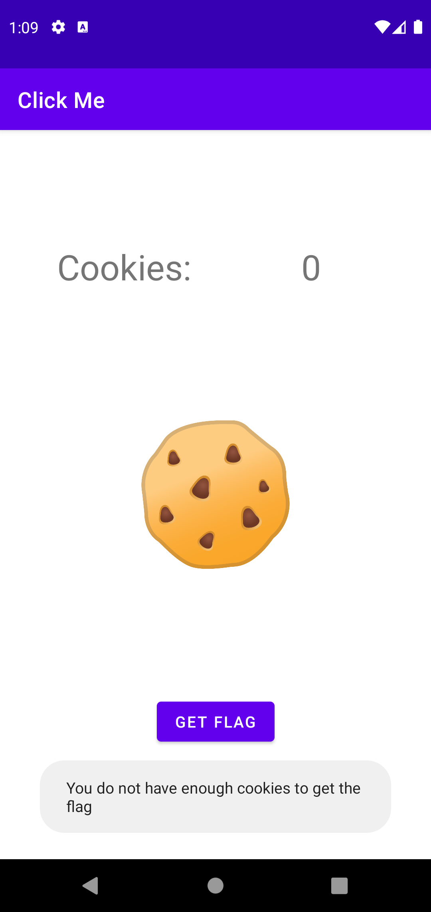
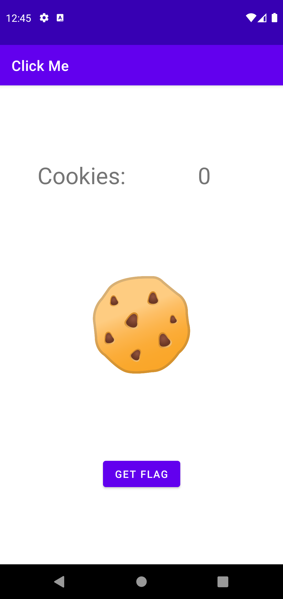

# Click Me! 

Mobile, Hard, 485 Points 🗡️🩸First Blood🩸🗡️

> I created a cookie clicker application to pass the time. There's a special prize that I can't seem to get. 

## Analysis

Decompiled the [click_me.apk](click_me.apk) with JADX:

`class MainActivity`:
```java
public final native String getFlag();
...
public final void getFlagButtonClick(View view) {
    Intrinsics.checkNotNullParameter(view, "view");
    if (this.CLICKS == 99999999) {
        Toast.makeText(getApplicationContext(), getFlag(), 0).show();
        return;
    }
    Toast.makeText(getApplicationContext(), "You do not have enough cookies to get the flag", 0).show();
}
```

All i had to do is hook on the `getFlagButtonClick` function and print the result of `flag()`

## Solution

Used frida and wrote the script:

`hook.js`:
```js
Java.perform(function(){
    Java.use("com.example.clickme.MainActivity").getFlagButtonClick.implementation = function (a) {
      console.log(this.getFlag());
      return;
    }
});
```

the run it with the command and clicked `GET FLAG` in device
```console
➜ CLICK frida -D emulator-5554 -l hook.js -f com.example.clickme --no-pause
     ____
    / _  |   Frida 15.1.17 - A world-class dynamic instrumentation toolkit
   | (_| |
    > _  |   Commands:
   /_/ |_|       help      -> Displays the help system
   . . . .       object?   -> Display information about 'object'
   . . . .       exit/quit -> Exit
   . . . .
   . . . .   More info at https://frida.re/docs/home/
   . . . .
   . . . .   Connected to Android Emulator 5554 (id=emulator-5554)
Spawned `com.example.clickme`. Resuming main thread!                    
[Android Emulator 5554::com.example.clickme ]-> flag{849d9e5421c59358ee4d568adebc5a70}

```
| Without any hooks | With Frida running | 
| --- | -- |
|  |  |