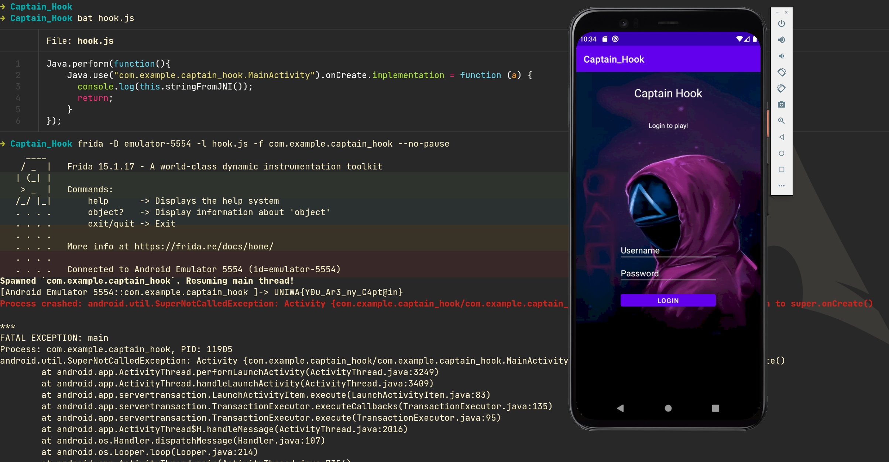

# Captain Hook 

Mobile, Medium, 400 Points 🗡️🩸First Blood🩸🗡️

>  Captain Hook has applied for a position in Squid Game 2022, but in order to take part into the game, he got asked to bypass the login screen of this app. Help him bypass it and he wont have the crocodile eat your hand. 

## Analysis

Decompiled the [Captain_Hook.apk](Captain_Hook.apk) with JADX:

First step, we go to **Resources** > **AndroidManifest.xml** to find the location of MainActivity

```xml
<activity android:name="com.example.captain_hook.Game" android:exported="false"/>
<activity android:name="com.example.captain_hook.MainActivity" android:exported="true">
```

`class MainActivity`:
```java
...
@Override // android.view.View.OnClickListener
public void onClick(View view) {
    if (!this.f2073b.getText().toString().equals("mitroglou") || !this.f2074c.getText().toString().equals(MainActivity.this.stringFromJNI())) {
        Toast.makeText(MainActivity.this, "Wrong username or password!", 1).show();
        return;
    }
    Intent intent = new Intent(MainActivity.this, Game.class);
    intent.putExtra("key", MainActivity.this.stringFromJNI()); // <-- This function again!
    MainActivity.this.startActivity(intent);
}
...
```
The app is obfuscated but after solving **Seek N Destroy** it pretty easy to guess that the native function `stringFromJNI()` contains the flag.

## Solution

We will hook the Captain_Hook app with Frida, and we will print `stringFromJNI()`.

`hook.js`:
```js
Java.perform(function(){
    Java.use("com.example.captain_hook.MainActivity").onCreate.implementation = function (a) {
      console.log(this.stringFromJNI());

      let ret = this.onCreate(a);
      return ret;
    }
});
```

```console
➜ Captain_Hook frida -D emulator-5554 -l hook.js -f com.example.captain_hook --no-pause
     ____
    / _  |   Frida 15.1.17 - A world-class dynamic instrumentation toolkit
   | (_| |
    > _  |   Commands:
   /_/ |_|       help      -> Displays the help system
   . . . .       object?   -> Display information about 'object'
   . . . .       exit/quit -> Exit
   . . . .
   . . . .   More info at https://frida.re/docs/home/
   . . . .
   . . . .   Connected to Android Emulator 5554 (id=emulator-5554)
Spawned `com.example.captain_hook`. Resuming main thread!               
[Android Emulator 5554::com.example.captain_hook ]-> UNIWA{Y0u_Ar3_my_C4pt@in}
Process crashed: android.util.SuperNotCalledException: Activity {com.example.captain_hook/com.example.captain_hook.MainActivity} did not call through to super.onCreate()
```

The app crashed when we hooked onCreate but we got the flag!

