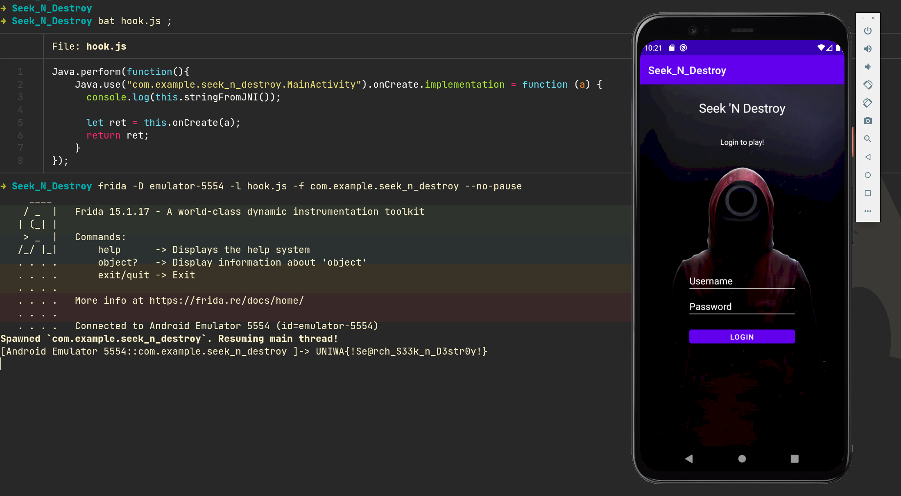

# Seek N Destroy 

Mobile, Easy, 200 Points 🗡️🩸First Blood🩸🗡️

> James Hetfield has applied a position in Squid Game 2022, but in order to take part into the game, he was asked to bypass the login screen of this app. Help him do this and he might find you a free ticket for the concert. 

## Analysis

Decompiled the [Seek_N_Destroy.apk](Seek_N_Destroy.apk) with JADX:

First step, we go to **Resources** > **AndroidManifest.xml** to find the location of MainActivity

```xml
<activity android:name="com.example.seek_n_destroy.MainActivity" android:exported="true">
```

`class MainActivity`:
```java
public class MainActivity extends AppCompatActivity {
    private ActivityMainBinding binding;

    public native String stringFromJNI();

    static {
        System.loadLibrary("seek_n_destroy");
    }

    /* JADX INFO: Access modifiers changed from: protected */
    @Override // androidx.fragment.app.FragmentActivity, androidx.activity.ComponentActivity, androidx.core.app.ComponentActivity, android.app.Activity
    public void onCreate(Bundle bundle) {
        super.onCreate(bundle);
        ActivityMainBinding inflate = ActivityMainBinding.inflate(getLayoutInflater());
        this.binding = inflate;
        setContentView(inflate.getRoot());
        final EditText editText = (EditText) findViewById(R.id.uname);
        final EditText editText2 = (EditText) findViewById(R.id.pass);
        final TextView textView = (TextView) findViewById(R.id.show);
        ((Button) findViewById(R.id.button)).setOnClickListener(new View.OnClickListener() { // from class: com.example.seek_n_destroy.MainActivity.1
            @Override // android.view.View.OnClickListener
            public void onClick(View view) {
                if (editText.getText().toString().equals("mitroglou") && MainActivity.md5(editText2.getText().toString()).equals("15eca8868ab1ae1828fff6bb7cf4b")) {
                    textView.setText(MainActivity.this.stringFromJNI());
                } else {
                    Toast.makeText(MainActivity.this, "Wrong username or password!", 1).show();
                }
            }
        });
    }

    public static String md5(String str) {
        ...
    }
}
```

Ok from our analysis we have a native library `seek_n_destroy` that has a function `String stringFromJNI()`.

```java
textView.setText(MainActivity.this.stringFromJNI());
```

That's suspicious. Maybe the flag is returned by the function `stringFromJNI()`.


## Solution

We will hook the Seek_N_Destroy app with Frida, and we will print `stringFromJNI()`.

`hook.js`:
```js
Java.perform(function(){
    Java.use("com.example.seek_n_destroy.MainActivity").onCreate.implementation = function (a) {
      console.log(this.stringFromJNI());

      let ret = this.onCreate(a);
      return ret;
    }
});
```

```console
➜ Seek_N_Destroy frida -D emulator-5554 -l hook.js -f com.example.seek_n_destroy --no-pause
     ____
    / _  |   Frida 15.1.17 - A world-class dynamic instrumentation toolkit
   | (_| |
    > _  |   Commands:
   /_/ |_|       help      -> Displays the help system
   . . . .       object?   -> Display information about 'object'
   . . . .       exit/quit -> Exit
   . . . .
   . . . .   More info at https://frida.re/docs/home/
   . . . .
   . . . .   Connected to Android Emulator 5554 (id=emulator-5554)
Spawned `com.example.seek_n_destroy`. Resuming main thread!             
[Android Emulator 5554::com.example.seek_n_destroy ]-> UNIWA{!Se@rch_S33k_n_D3str0y!}
```

Solved!

