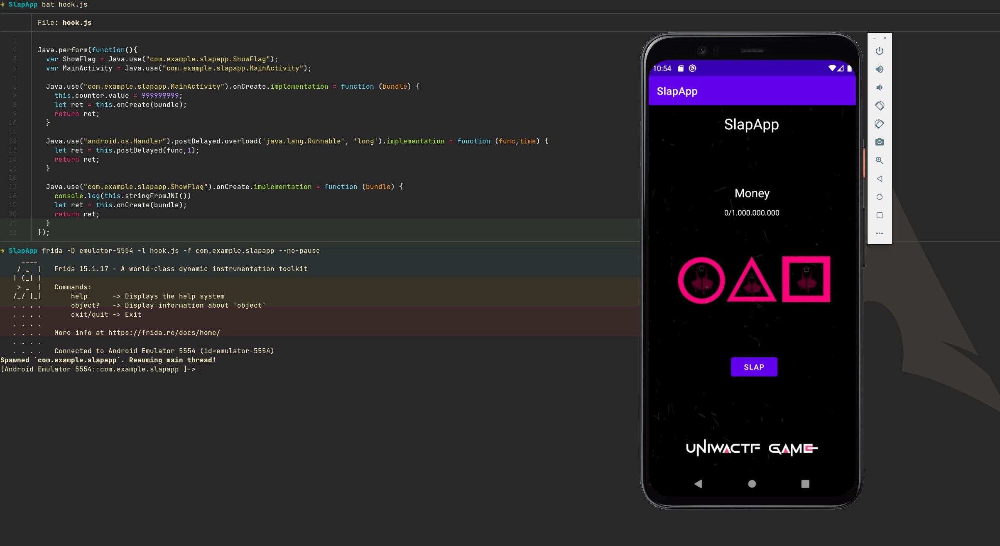
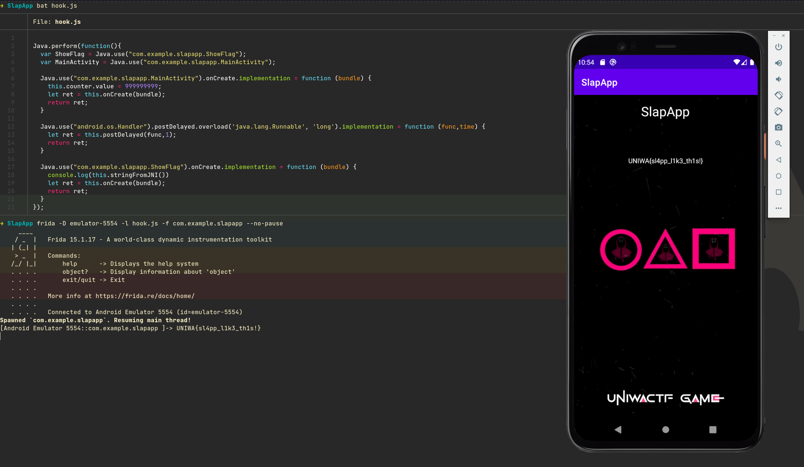

# SlapApp 

Mobile, Easy, 200 Points 🗡️🩸First Blood🩸🗡️

>  A heard there is an easy way to make money. All you have to do, is slap 1.000.000.000 times.

## Analysis

Decompiled the [Captain_Hook.apk](Captain_Hook.apk) with JADX:

First step, we go to **Resources** > **AndroidManifest.xml** to find the location of MainActivity

```xml
<activity android:name="com.example.slapapp.ShowFlag" android:exported="false"/>
<activity android:name="com.example.slapapp.MainActivity" android:exported="true">
```

Ok, `ShowFlag` interesting name for Class. Definitelly we should check it. Let's start with **MainActivity**.

`class MainActivity`:
```java
int counter = 0;

...

@Override // android.view.View.OnClickListener
public void onClick(View view) {
    ...
    if (MainActivity.this.counter >= 1000000000) {
        Toast.makeText(MainActivity.this, "Come back to get the Flag after 4 days.", 1).show();
        new Handler().postDelayed(new Runnable() { // from class: com.example.slapapp.MainActivity.1.1
            @Override // java.lang.Runnable
            public void run() {
                Intent intent = new Intent(MainActivity.this, ShowFlag.class);
                intent.putExtra("showFlag", "true");
                MainActivity.this.startActivity(intent);
            }
        }, 400000000L);
        return;
    }
    MainActivity.this.counter++;
    textView.setText(String.valueOf(MainActivity.this.counter) + "/1.000.000.000");
}
```

Se can see a button that increases a counter. We have to reach 1000000000 clicks. 

Then it does an Intent that opens the other Activity named **ShowFlag**.

But be careful. That intent is inside a Handler that executes these lines after 4.6 days. We can't wait for so long!

What about **ShowFlag** now?

`class ShowFlag`:
```java
public native String stringFromJNI();

public void onCreate(Bundle bundle) {
    super.onCreate(bundle);
    setContentView(R.layout.activity_show_flag);
    if (getIntent().getStringExtra("showFlag").equals("true")) {
        ((TextView) findViewById(R.id.textView3)).setText(stringFromJNI()); // <-- stringFromJNI()
    }
}
```

Ok, if the intent has extra showFlag == "true" we get a textview with the flag.

## Solution

We will write our code in 3 steps.

Step 1: Hook on MainActivity and set counter value to 999999999. Two clicks and we get to the juicy Handler.

Step 2: Hook on the handler and override the time from 4 days to 1 millisecond

Step 3: Hook the ShowFlag and print the flag from `stringFromJNI()`

`hook.js`:
```js
Java.perform(function(){
  var ShowFlag = Java.use("com.example.slapapp.ShowFlag");
  var MainActivity = Java.use("com.example.slapapp.MainActivity");
  
  // Step 1
  Java.use("com.example.slapapp.MainActivity").onCreate.implementation = function (bundle) {
    this.counter.value = 999999999;
    let ret = this.onCreate(bundle);
    return ret;
  }

  // Step 2
  Java.use("android.os.Handler").postDelayed.overload('java.lang.Runnable', 'long').implementation = function (func,time) {
    let ret = this.postDelayed(func,1);
    return ret;
  }

  // Step 3
  Java.use("com.example.slapapp.ShowFlag").onCreate.implementation = function (bundle) {
    console.log(this.stringFromJNI())
    let ret = this.onCreate(bundle);
    return ret;
  }
});
```

```console
➜ SlapApp frida -D emulator-5554 -l hook.js -f com.example.slapapp --no-pause
     ____
    / _  |   Frida 15.1.17 - A world-class dynamic instrumentation toolkit
   | (_| |
    > _  |   Commands:
   /_/ |_|       help      -> Displays the help system
   . . . .       object?   -> Display information about 'object'
   . . . .       exit/quit -> Exit
   . . . .
   . . . .   More info at https://frida.re/docs/home/
   . . . .
   . . . .   Connected to Android Emulator 5554 (id=emulator-5554)
Spawned `com.example.slapapp`. Resuming main thread!                    
[Android Emulator 5554::com.example.slapapp ]-> UNIWA{sl4pp_l1k3_th1s!}
```

The app crashed when we hooked onCreate but we got the flag!

## Screenshots

Screenshot 1: Frida hook



Screenshot 2: After two "slaps" (clicks) we get to the ShowFlag Activity!

